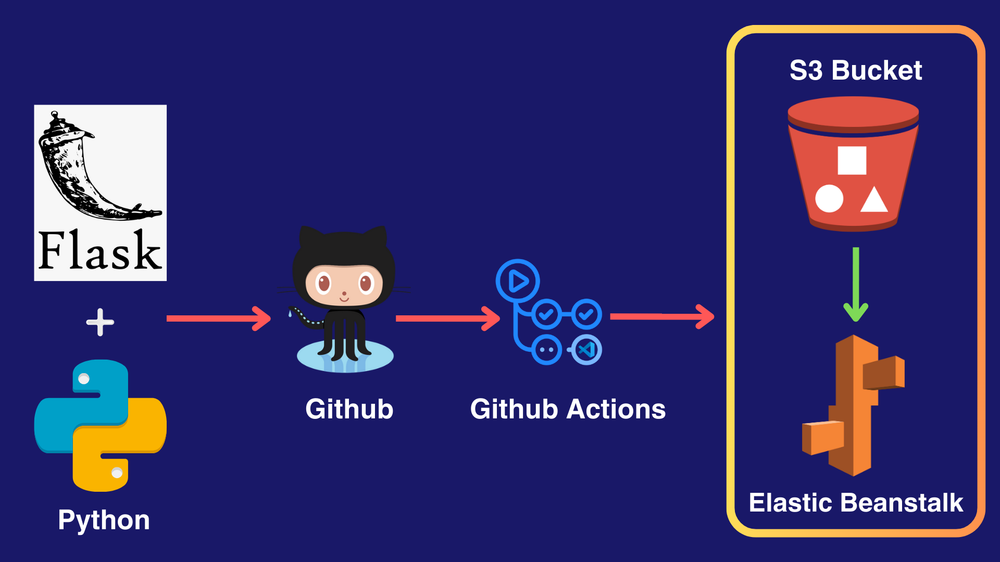
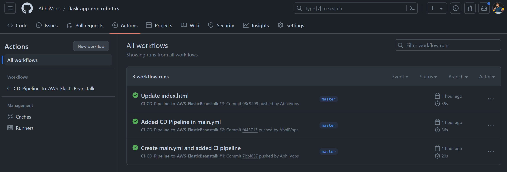
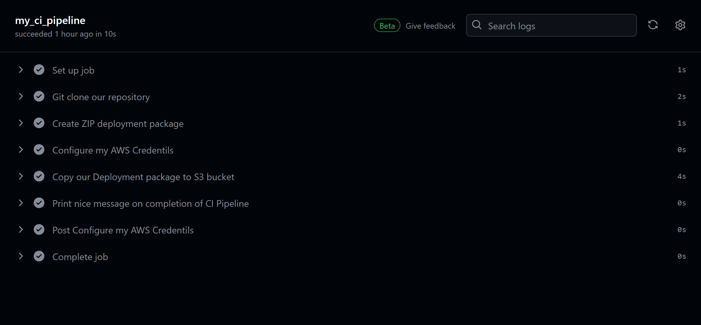
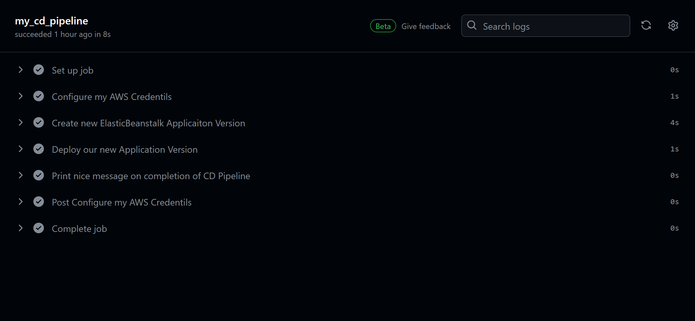
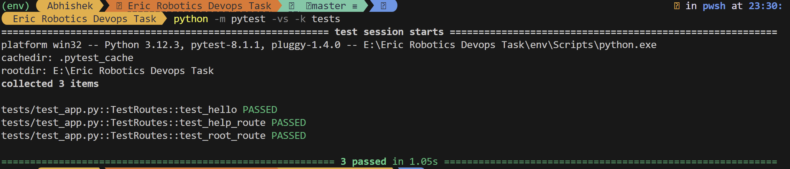
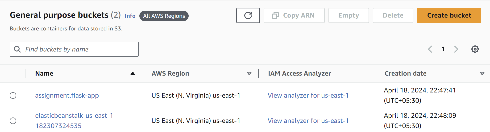
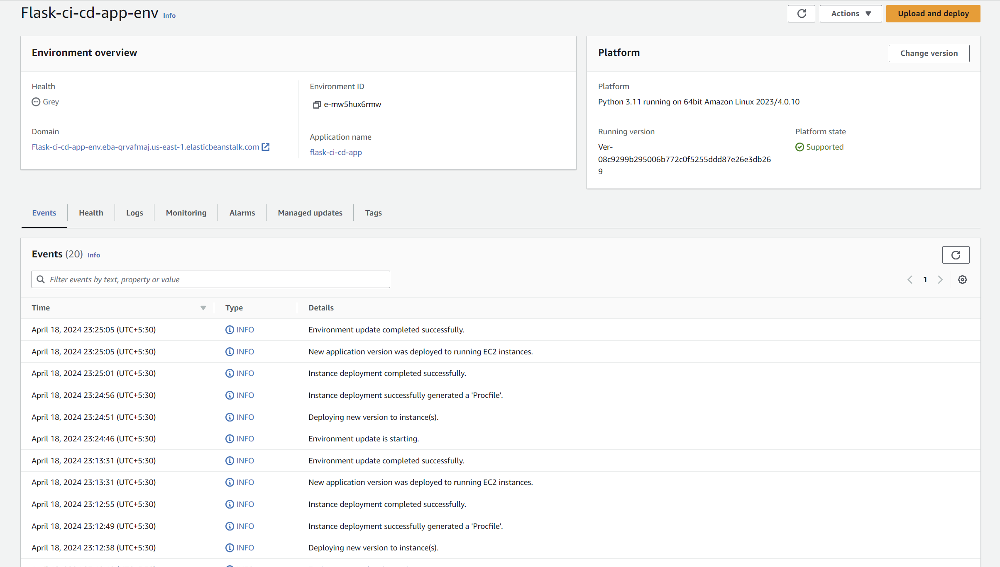

# Flask Web Application with CI/CD Pipeline using GitHub Actions

## Overview

This repository contains a basic **Flask web application** along with a CI/CD pipeline implemented using **GitHub Actions** and deployed using **AWS Elastic Beanstalk** and stored in an **AWS S3 bucket**. The pipeline automates the testing and deployment process of the web application.

## Workflow and Deployment



## Steps to Run the Application

1. **Clone the Repository:**
    ```
    git clone https://github.com/AbhiiVops/flask-app-eric-robotics.git
    ```

2. **Create a Virtual Environment:**
    ```
    python -m venv env
    ```

3. **Activate the Virtual Environment:**
    - On Windows:
        ```
        .\env\Scripts\activate
        ```
    - On macOS and Linux:
        ```
        source env/bin/activate
        ```

4. **Install Dependencies:**
    ```
    pip install -r requirements.txt
    ```

5. **Run the Application:**
    ```
    python app.py
    ```

6. **Access the Application:**
    Open a web browser and go to `http://localhost:5000`.

## Pipeline Explanation



The CI/CD pipeline is implemented using GitHub Actions. Upon every push to the repository, the following steps are executed:

1. **Checkout Repository**: The pipeline starts by checking out the repository to access the latest codebase.

2. **Run Tests**: In the CI phase, the workflow checks out the latest code changes and runs automated tests. Unit tests are executed using pytest to ensure the code's functionality remains intact.

3. **Build Artifacts**: If the tests pass successfully, the workflow proceeds to the CD phase. Here, it may build any necessary artifacts, such as executable binaries, or static files for a website.

4. **Upload to AWS S3 Bucket**: After successful testing, the codebase is uploaded to an AWS S3 bucket for storage. S3 provides scalable, secure, and highly available object storage.

5. **Deploy to AWS Elastic Beanstalk**: Once the codebase is stored in the S3 bucket, AWS Elastic Beanstalk is triggered to deploy the application. Elastic Beanstalk automatically handles the deployment, from capacity provisioning and load balancing to application health monitoring.


## Glimpse of the CI/CD Process Report

### Phase 1: Continuous Integration


### Phase 2: Continuous Deployment


### Tools Used
- **GitHub Actions**: Chosen for its seamless integration with GitHub repositories, allowing for automated testing and deployment workflows.
- **pytest**: A popular testing framework for Python, chosen for its simplicity and ease of use in writing unit tests.
- **Flask**: A lightweight WSGI web application framework in Python, chosen for its simplicity and flexibility in building web applications.
- **Flask-Testing**: A testing extension for Flask applications, used to simplify the testing process by providing utilities for making requests and assertions.
- **AWS S3**: Used for storing the codebase, providing scalable and reliable object storage.
- **AWS Elastic Beanstalk**: Selected for deployment due to its ease of use and scalability, allowing for the deployment and management of web applications without needing to manage the underlying infrastructure.


### Scalability
For larger applications, the pipeline setup can be scaled by:
- Implementing more comprehensive testing suites, including integration and end-to-end tests.
- Utilizing advanced deployment strategies such as blue-green deployments or canary releases.
- Incorporating monitoring and logging solutions using AWS CloudWatch to track the application's performance and health.
- Utilizing AWS services like AWS Lambda or AWS Fargate for more advanced and scalable deployment options.

## Location of GitHub Actions Workflow
The GitHub Actions workflow configuration file (`main.yml`) can be found in the `.github/workflows/` directory of this repository.

## Location of Test File
The test file (`test_app.py`) can be found in the `tests` directory of this repository.

## Steps to Run Tests




To run the tests, execute the following command:
    
```
python -m pytest -vs -k tests
``` 

## Glimpse of the S3 Bucket and Elastic Beanstalk Deployment 

### S3 Bucket


### Elastic Beanstalk


## Conclusion
The implemented CI/CD pipeline automates the testing and deployment process of the web application, leveraging AWS services for storage and deployment, ensuring reliability and efficiency in the software development lifecycle. The pipeline can be further enhanced by incorporating additional testing strategies, deployment options, and monitoring solutions to meet the needs of larger and more complex applications.

## Acknowledgements

- [AWS-Elastic-Beanstalk](https://aws.amazon.com/elasticbeanstalk/)
- [AWS-S3](https://aws.amazon.com/s3/)
- [AWS-EC2](https://aws.amazon.com/ec2/)
- [Flask](https://flask.palletsprojects.com/en/2.0.x/)
- [Flask-Testing](https://flask.palletsprojects.com/en/2.0.x/testing/)
- [GitHub-Actions](https://docs.github.com/en/actions)
- [pytest](https://pytest.org/)
- [Python](https://www.python.org/)
